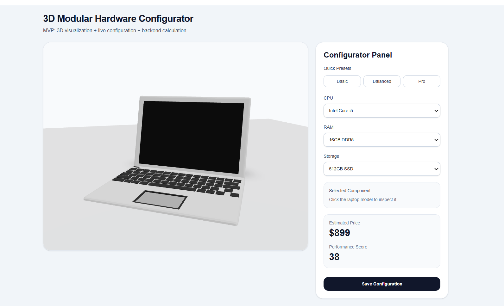
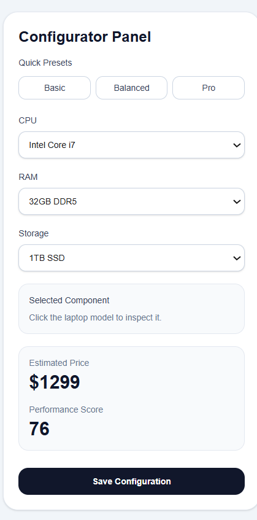

# 3D Hardware Configurator


Interactive 3D laptop configurator that allows users to explore a WebGL-based device model, customize hardware components (CPU, RAM, Storage), and instantly see how configuration changes affect price and performance.

The application renders a 3D laptop model using **React Three Fiber** and enables interactive product configuration similar to modern e-commerce hardware configurators.

---

## Demo


---

## Screenshots

### 3D Product View


### Configuration Panel


---

## Features

- Interactive 3D laptop visualization
- Hardware configuration (CPU, RAM, Storage)
- Real-time price calculation
- Performance scoring
- Quick configuration presets
- Component inspection by clicking the 3D model
- Save configuration API
- Clean modern UI

---

## Tech Stack

### Frontend
- Next.js
- React
- TypeScript
- TailwindCSS

### 3D Engine
- Three.js
- React Three Fiber
- Drei helpers

### Backend
- Next.js API Routes
- Prisma ORM
- SQLite / PostgreSQL ready

---

## Project Structure

```text
app/                API routes and UI pages
assets/             project screenshots and demo gif
public/models/      3D models
prisma/             database schema

---

## Installation

Clone the repository:

```bash
git clone https://github.com/MazurPavel/3d-hardware-configurator.git
cd 3d-hardware-configurator
```

Install dependencies:

```bash
npm install
```

Run the development server:

```bash
npm run dev
```

Open the application in your browser:

```
http://localhost:3000
```

Note: `localhost:3000` is a **local development URL** and will only work on your own machine unless the project is deployed.

---

## Future Improvements

* GPU configuration
* SSD tiers
* Color customization
* Product animation
* Online deployment
* Database persistence
* Configuration export / share

---

## Author

**Pavel Mazur**

GitHub:
https://github.com/MazurPavel

